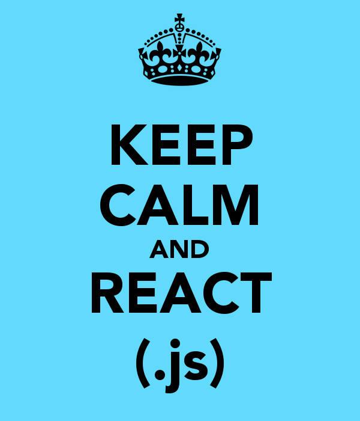

# HOMEWORK: CREATE REACT APP!!!

Tonight, you'll be practicing using `create-react-app`.  Here's what you'll do:

- Read these chapters of the React docs:
  * [hello-world](https://facebook.github.io/react/docs/hello-world.html)
  * [introducing JSX](https://facebook.github.io/react/docs/introducing-jsx.html)
  * [rendering elements](https://facebook.github.io/react/docs/rendering-elements.html)
  
- Run `create-react-app` in this directory to make a new react app.
- Make the page say something other than Welcome to React!
- Comment out every line of the app
- Done? Go back to your outstanding assignments and complete them 💪

## 🚀 Completion looks like:

- You have created a React app that, when loaded, says something other than "Welcome to React"
- 🚨🚨🚨🚨 You've worked on any previous assignments!!! 🚨🚨🚨🚨

## 🚀 Your homework submission should include:

- An Pull request created on this repo
- Completion, comfort, wins, losses, questions... you know the drill.

## This homework is due 🚨 11PM ON THURSDAY NIGHT!!! 🚨
